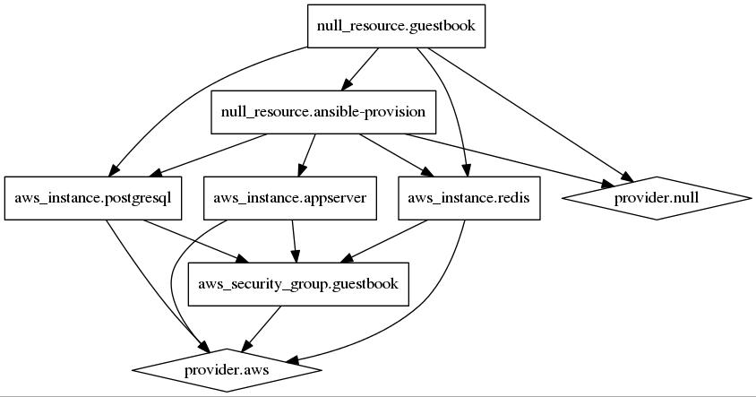

Deployment Code of Guestbook Server
=========================

This provides a template for running a guestbook app with rails server on Amazon Web services.

* guestbook_server

## Getting Started

This README file is inside a folder that contains a terraform configuration.

To use the terraform deployment, you will need to have done the following:

  1. Download and Install [Terraform 0.6.16](https://releases.hashicorp.com/terraform/0.6.16/terraform_0.6.16_linux_amd64.zip), so please download this version only and extract to your /usr/local/bin and set your environment path to run `terraform` command.
  2. Install [Ansible](http://docs.ansible.com/intro_installation.html)
  3. Run the following command to install the necessary Ansible roles for this profile: `$ ansible-galaxy install -r requirements.yml`

Once all of that is done, you can simply type in `vagrant up`, and Vagrant will create a new VM, install the base box, and configure it.

To simplify the example, this intentionally ignores deploying and
getting your application onto the servers. However, you could do so either via
[provisioners](https://www.terraform.io/docs/provisioners/) and a configuration management tool

After you run `terraform apply` on this configuration, it will
automatically output the guestbook url and postgresql server ip. After your instance
successful provisioned with ansible, this should respond with the default guestbook web page.

To run, configure your AWS provider as described in [here](https://www.terraform.io/docs/providers/aws/index.html)

To provision your stack, run terraform commands like this:

copy `terraform.tfvars.example` to `terraform.tfvars` and update values with actual

```
cp terraform.tfvars.example terraform.tfvars
``` 

For example:

* Use following commands to deploy the stack..

To get Terraform to plan the execution of the provisioner for a specific node/server

```
terraform plan
```

To apply the plan to actual deployment

```
terraform apply
```

* If you wants to re-provision your stack, followed the below commands 

Trigger ansible re-provisioning on a single node using `terraform taint` and after that use `plan` and `apply`

```
terraform taint null_resource.guestbook
```

To get Terraform to plan the execution of the provisioner for a specific node/server

```
terraform plan
```

To apply the plan to actual deployment

```
terraform apply
```

## terraform graph
Example graph phase against a clean environment


