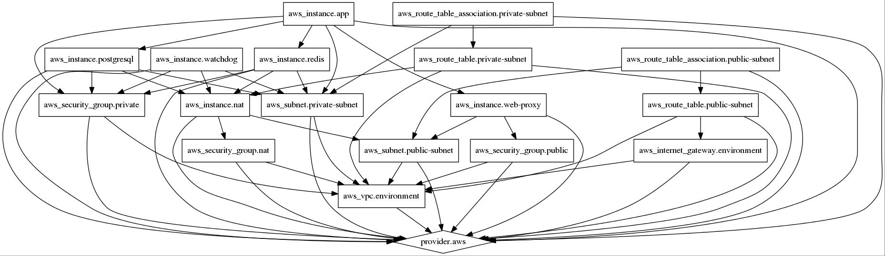

Deployment Code of Guestbook
=========================

This provides a templates for running a complex multi-tier architecture on AWS vpc environment. 
It setting up multi node cluster for guestbook application.

AWS -
1) VPC

Instances -
1) nat - Bastion Host
2) proxyserver - App gateway
3) appserver - serving application
4) database - postgresql database
5) redis - redis database
6) watchdog - check_mk monitoring server


To simplify the example, this intentionally ignores deploying and
getting your application onto the servers. However, you could do so either via
[provisioners](https://www.terraform.io/docs/provisioners/) and a configuration
management tool.

After you run `terraform apply` on this configuration, it will
automatically output the guestbook and watchdog url. After your instance
registers and successful run with chef, this should respond with the default guestbook web page.

To run, configure your AWS provider as described in

https://www.terraform.io/docs/providers/aws/index.html

Run with a command like this:

```
terraform apply -var 'key_name={your_aws_key_name}' \
   -var 'key_path={location_of_your_key_in_your_local_machine}'`
```

For example:

```
terraform apply -var 'key_name=terraform' -var 'key_path=/Users/jsmith/.ssh/terraform.pem'
```

* The best to just use existing any environment `tfvariable.example`, copy it to `anyname.tfvariables` and adjust your variables, that't it.

To run, configure your _secret.tfvariables_ as described in my_first_vpc_environment.tfvariables.example

Plan:

```
terraform plan -var-file="my_first_vpc_environment.tfvariables"
```

Apply:

```
terraform apply -var-file="my_first_vpc_environment.tfvariables"
```

Destroy:

```
terraform destroy -var-file="my_first_vpc_environment.tfvariables"
```

## terraform graph
Example graph phase against a clean environment



